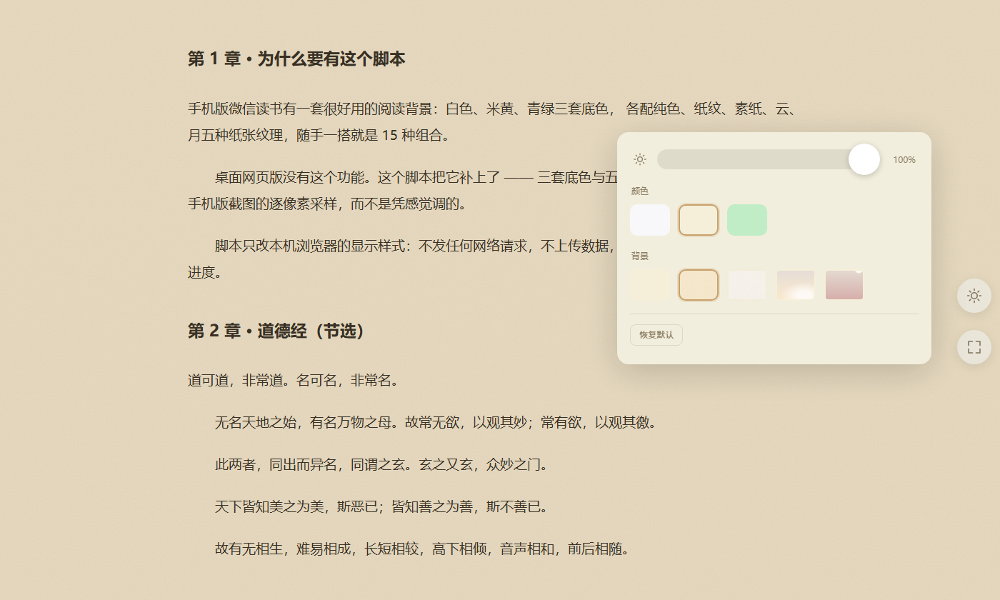
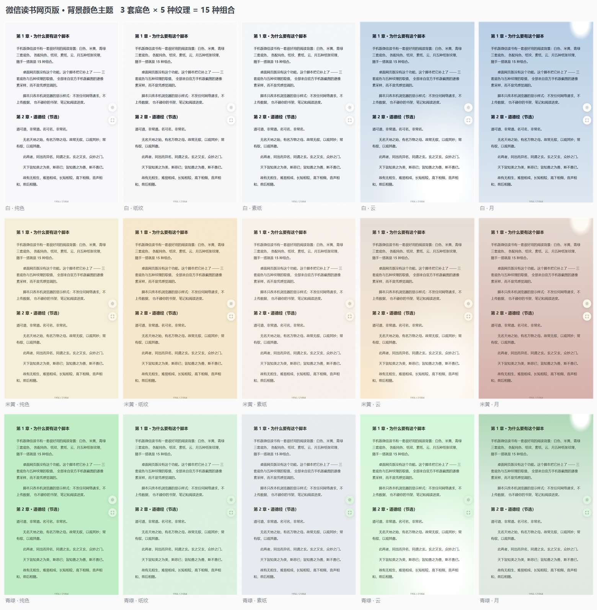

# 微信读书网页版 · 背景颜色主题

给[微信读书网页版](https://weread.qq.com/web/reader/)的阅读页补上**手机 App 才有的背景功能**：
白天 3 套底色 × 5 种纸张纹理 = **15 种组合**，另加一个全屏阅读按钮。

> **非官方脚本，与腾讯 / 微信读书无任何关联。**
> 它只在**你自己的浏览器**里改显示样式 —— 不发任何网络请求、不上传任何数据、
> 不碰你的书架、笔记和阅读进度。详见下面的[封号风险](#封号风险)。

---

## 效果



面板从左到右是三块：**亮度滑杆**、**颜色**（3 套底色）、**背景**（5 种纹理），下面是恢复默认。
工具条上多出来的两个按钮是 **☀ 背景面板** 和 **⛶ 全屏阅读**。

下面这张是 **3 套底色 × 5 种纹理 = 15 种组合**的全览：

[](screenshots/主题矩阵.jpg)

| | |
|---|---|
| **底色** | 白 `#f8f8fa` · 米黄 `#f5efd9` · 青绿 `#c0edc6` |
| **纹理** | 纯色 · 纸纹 · 素纸 · 云 · 月 |
| **组合** | 3 × 5 = **15 种**，底色与纹理自由搭配 |
| **黑夜** | **整块交还官方原装外观**，脚本一点都不碰 |

> 这两张图是**本项目自己渲染的**，不是官方 App 的截图：本地起一个最小 demo 阅读页、
> 真加载脚本后 headless 截图（文案是《道德经》先秦公版 + 本项目的自我介绍）。
> 生成脚本 `工具/生成截图.ps1` **自带校验** —— 它会断言脚本真的注入了按钮、
> 15 格底色互不相同且纯色格等于官方实测值，任一不过就报错退出，不允许产出假图。

三套底色不是凭感觉调的，而是**从官方 App 截图逐像素采样**得到的。
半透明叠加层的取值是**算出来的，不是调出来的**：底色记 `B`、官方实测记 `T`，
层用 `alpha = 0.5` 时合成结果是 `0.5×层 + 0.5×B`，所以 **层 = 2T − B**。

## 安装

1. 给浏览器装 [Tampermonkey](https://www.tampermonkey.net/)（或 Violentmonkey）
2. 安装脚本 —— 点这里：
   [`weread-bg-theme.user.js`](https://raw.githubusercontent.com/ForestSun2023/weread-bg-theme/main/weread-bg-theme.user.js)
3. 打开任意一章阅读页：`https://weread.qq.com/web/reader/...`
4. **把鼠标移到页面中间** —— 右侧工具条平时是隐藏的，移动鼠标才会浮出来

## 使用

工具条最下方是本脚本的两个按钮（固定在所有原生按钮之后）：

| 按钮 | 作用 |
|---|---|
| **☀ 背景** | 打开/关闭背景面板（**只在白天出现**） |
| **⛶ 全屏阅读** | 全屏 / 退出全屏，图标与提示跟着状态切换 |

面板里可以调：**亮度滑杆**、**颜色**（3 套）、**背景**（5 种纹理）、**恢复默认**。
快捷键 **`b`** 开关面板（在输入框 / 写想法的地方不会误触发），`Esc` 或点面板外的遮罩关闭。

**设置自动保存**（`localStorage` 的 `wrbg.settings.v1`），换页、刷新、重开浏览器都还在。

### 控制台 API

在阅读页按 `F12` → Console：

```js
wrbg.state        // { colorId, bgId, brightness }
wrbg.set({ colorId: 'sepia', bgId: 'paper', brightness: 0.9 })
wrbg.reset()
wrbg.colors       // ['white','sepia','green']
wrbg.backgrounds  // ['solid','paper','plain','cloud','moon']
wrbg.dark         // 当前是不是黑夜（黑夜下脚本整块让位）
wrbg.fullscreen   // 全屏诊断：F11 无法直接查询，这里能看到脚本的推断依据
```

## 白天 / 黑夜是怎么分工的

**一句话：脚本只管白天；一进黑夜就整块让位，只多一个「全屏」按钮。**

| | 底色 / 正文 / 位图 / 弹层 | 「背景」按钮 | 「全屏」按钮 |
|---|---|---|---|
| **白天** | 全部由脚本画 | 显示 | 显示 |
| **黑夜** | **官方原装，脚本一点都不碰** | 隐藏 | 显示 |

实现上就一句：进黑夜时把 `data-wrbg` 摘掉，所有覆盖规则随之失效；
**并把白天写在 `<html>` 上的全部 `--wrbg-*` 内联变量一并清掉**，
所以「黑夜下零残留」是结构性事实，而不是靠每条规则都记得写作用域。

> ### ⚠️ 昼夜切换请用站点原生的「深色」按钮
>
> 本脚本**故意不自己造这个按钮**（v3.0.0 造过，v3.1.0 撤掉了）。
>
> 因为阅读器的正文有一部分是引擎**光栅化进 `<canvas>` 的位图** —— 字色在绘制那一刻就烤进像素里了。
> 只翻一个 CSS 类**不会通知引擎重绘**：从黑夜切回白天时，引擎还以为在黑夜、继续按浅色画字，
> 而浅色纸底已经铺上去，两者一叠就成了「浅色字压在浅色纸上」，几乎看不见。
> 站点原生的按钮走的是引擎自己的状态，重绘时机才是对的。
>
> （也不能靠脚本去「点」那个按钮绕过 —— 那是模拟用户操作，会踩封号审查的红线。）

## 封号风险

这是本项目**每一版都要过的一道关卡**（`工具/安全审查.ps1`，五类危险模式必须命中 0）。
脚本的行为边界是：

**会做的**

- 往阅读页插一个 `<style>`：用 `:root` CSS 变量 + `!important` 覆盖底色 / 正文色 / 顶栏 / 弹层配色
- 往工具条插两个按钮（沿用站点自己的 `readerControls_item` 样式）
- 往 `localStorage` 写一个键：`wrbg.settings.v1`（只存配色、纹理、亮度）
- 读 `<body>` 的 class 判断站点是否处于深色（**只读，不写**）

**不会做的**（静态检查会逐条确认命中数为 0）

| 类别 | 说明 |
|---|---|
| 网络请求 | 无 `fetch` / `XMLHttpRequest` / `WebSocket` / `sendBeacon` |
| 动态执行代码 | 无 `eval` / `new Function` |
| 外部依赖 | 无 `@require` / `@connect` / `GM_*`，`@grant none` |
| 读取/篡改站点数据 | 不碰 `document.cookie`、不碰框架内部对象（`__vue__` 等） |
| 模拟用户操作 | 无 `.click()` / `dispatchEvent` |

脚本内出现的 `http(s)://` 只有元数据（`@namespace` / `@match`）和噪点 SVG 的命名空间字符串。

## 已知限制

- **官方纹理其实是照片**。放大官方截图可以看到：「云」的底部是一张雪山照片、「月」是带环形山的真实月球照片。
  CSS 渐变只能还原**位置、大小、亮度和明暗走向**，还原不出山脊和环形山。
  （顺带一提：官方 App 里的背景确实是引擎按颜色配置**程序化绘制**的，不是位图 —— 见 v1.8.0 的解包结论。）
- **不碰排版**。边距、行距、段间距、首行缩进都没有 —— 阅读引擎没有暴露这些参数，
  `--wr-reader-render-*` 那批 CSS 变量是引擎的**输出**而不是输入，改它们没有任何效果。
  把正文逐字绝对定位的布局用 CSS 重排也不可行（原因写在设计文档第三节）。
- **黑夜下没有背景功能**，这是刻意的（见上文分工）。
- **不支持自定义图片背景** —— 那样就得引入外部资源，脚本不再是单文件、离线可用，
  亮度滑杆也会失效（不透明贴图会把压暗的底色完全盖住）。

## 开发与验证

```powershell
pwsh -File "工具\交付检查.ps1"     # 一条命令跑完全部五道关卡，并往 工具/审查记录.md 追加一条
# 退出码 0 = 全部通过；>0 = 未通过的关卡数
```

| # | 关卡 | 做什么 |
|---|---|---|
| 1 | **封号风险审查** | 五类危险模式必须命中 0 |
| 2 | **功能回归** | 42 条断言 × 2 个模式快照（纵向 / 双栏） |
| 3 | **死代码检查** | 函数名全文只出现 1 次 = 只有定义没有调用 |
| 4 | **体积** | 与上次记录对比并报增量（本项目**以字节数为准**，行数指标不可信） |
| 5 | **像素验证** | 15 种组合实拍 1240×2772，页边三段色值对官方实测，另验云的走向 / 月亮位置 / 色调方向 |

### 准备测试夹具

第 2、5 关需要**阅读页快照**（`.html`），它们**不在仓库里** —— 快照包含整章小说正文，属于版权内容。

自己准备一份即可：用 [SingleFile](https://github.com/gildas-lormeau/SingleFile) 扩展把阅读页存成 `.html`，
放到仓库根目录（工具会自动发现）。纵向和双栏各存一份最好，能覆盖两种布局。

> 历史踩坑（都写进脚本注释了，值得一读）：
> 快照里会原样保留站点的 `<meta http-equiv=content-security-policy>`，
> 内容是 `default-src 'none'` 且**没有 `connect-src`** → 页面里任何 `fetch` 都被浏览器掐掉。
> 验证工具会在构建测试页时摘掉它，否则「断言全跑完了，结果却回传不出来」。

## 目录结构

```
.
├─ weread-bg-theme.user.js   # 脚本本体（单文件、零依赖、离线可用）
├─ 使用说明.md                 # 面向使用者的说明
├─ 设计思路.md                 # 面向开发者的设计推导 + 实测数据 + 版本沿革
├─ CHANGELOG.md
├─ LICENSE
├─ screenshots/               # README 用图（由 工具/生成截图.ps1 渲染，带自校验）
└─ 工具/
   ├─ 交付检查.ps1            # 唯一入口：五道关卡
   ├─ 安全审查.ps1            # 封号风险静态审查
   ├─ 回归验证.ps1            # 功能回归（headless Edge + 页内断言）
   ├─ 像素验证.ps1            # 15 种组合实拍比对
   ├─ 生成截图.ps1            # 渲染 README 配图（自带校验，不做假图）
   ├─ 审查记录.md              # 每版一行，自动追加
   └─ weread-probe*.js        # 站点 DOM 变动时的诊断脚本（贴进 Console 跑）
```

## 设计文档

[`设计思路.md`](设计思路.md) 里有：阅读引擎的四个实测事实（按字绝对定位、DOM 只保留一屏其余光栅化、
`--wr-reader-render-*` 是输出不是输入、引擎没有行距/缩进概念）、官方配色的采样方法与实测表、
每一次方案取舍的推导过程，以及一份**失败方案清单**（为什么「黑夜下自己刷一层黑」和
「把站点钉在浅色 + 藏掉深色按钮」都行不通）。

## 许可

[MIT](LICENSE) © 2026 ForestSun

脚本不包含任何来自微信读书 / 腾讯的代码或素材。
